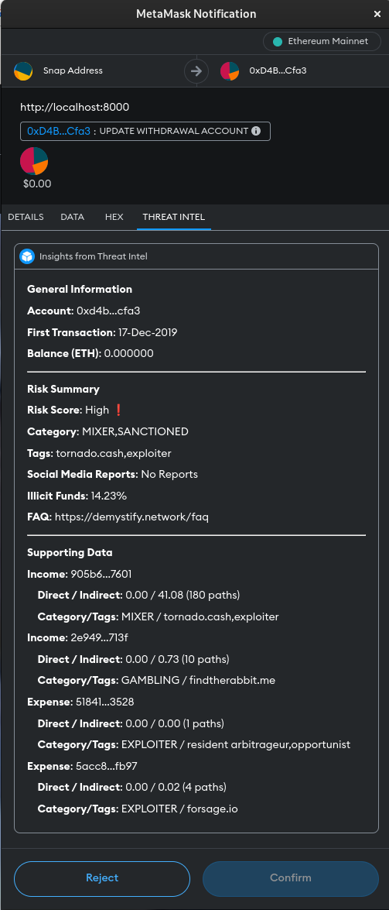
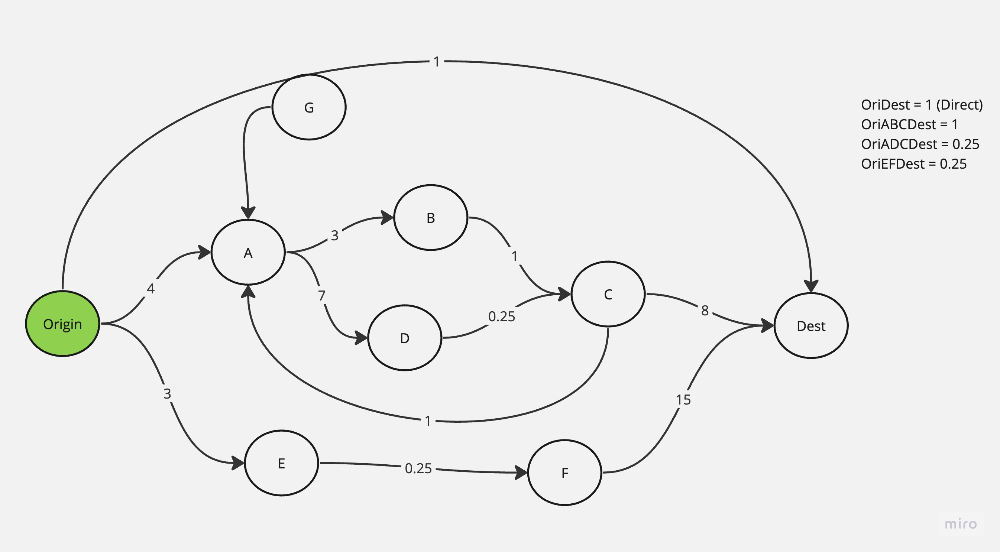

# How to run 
* Make sure you follow SupportScripts and start database before running this application
* Run locally:  `mvn spring-boot:run -Dspring-boot.run.profiles=development`
* Deploy to production: `./build.sh`

# Why Demystify Network ?

Blockchains are built on the concept on anonymity and permissionless inclusivity. This means any one can participate in blockchain without revelaing who they are and without permission from anyone. While this sounds like a financial democracy, bad actors tend to misuse this as an opportunity to disguice and commit fraud.

While there are many solutions in market to protect businesses at a price, there exists no solutions to protect individual users. This not only allow bad actors to target individuals but also negatively impact the adoption of blockchains.

Demystify Network was built with an intent to protect end users for free and keep the bad actors away while promoting blockchain adoption. Demystify Network achieves it by generating real-time threat intel.

This project was built with generous grants from Google Web3 Startups and Metamask(Consensys).

# What does Demystify Network do?

[Have a look at short Demo](https://youtu.be/6S3rVBa6WNQ?feature=shared)

At the very core, Demystify Network provids novel illicit fund detection and risk scoring algorithm wrapped behind a API.
1) It takes any ethereum address as input.
2) Provides a risk score between 0 to 10
3) Identifies actual incomes and expenditure sources (ignoring all the addresses in between)
4) Detects illicit fund flow (income as well as expenditures)
5) Does all of it real-time, can evaluate millions of relationships in less than 2 seconds due to its unique in-memory representation.

Here is a example of how the risk profile of a address looks like from within MetaMask wallet. When integrated with wallet, user of the wallet gets threat intel right before signing the transaction and there by enabling the user to protect themselves from frauds and scams.

# What are the key components of Demystify Network?

Demystify Network has 3 main components.
1) Backend - This project is application backend and implements a novel illicit fund detection algorithm specially designed for blockchains. Techincally, its level order bfs custom built for blockchains to trace money laundering and illicit fund detection.
2) MetaMask Front end - https://github.com/demystify-network/ThreatIntelligence
3) DataLake - Holds a unique in-memory representation of entire blockchain(ethereum), along with ability to scan web2 and social media for realtime threats.

# How does it do that?

Think of Blockchain address as nodes and transactions as relationships a.k.a. edges. This converts blockchain into a massive directed and weighted graph. 

Its gets a lot easier after this. As shown in the screen shot below, we use level order BFS (it's more complicated than that though), to transverse the relationships and identify incomes and expenditures. And along the way we calculate risk score based on 
1) identified & tagged bad actors
2) percent of illicit funds
3) distance and weight of relationships.

